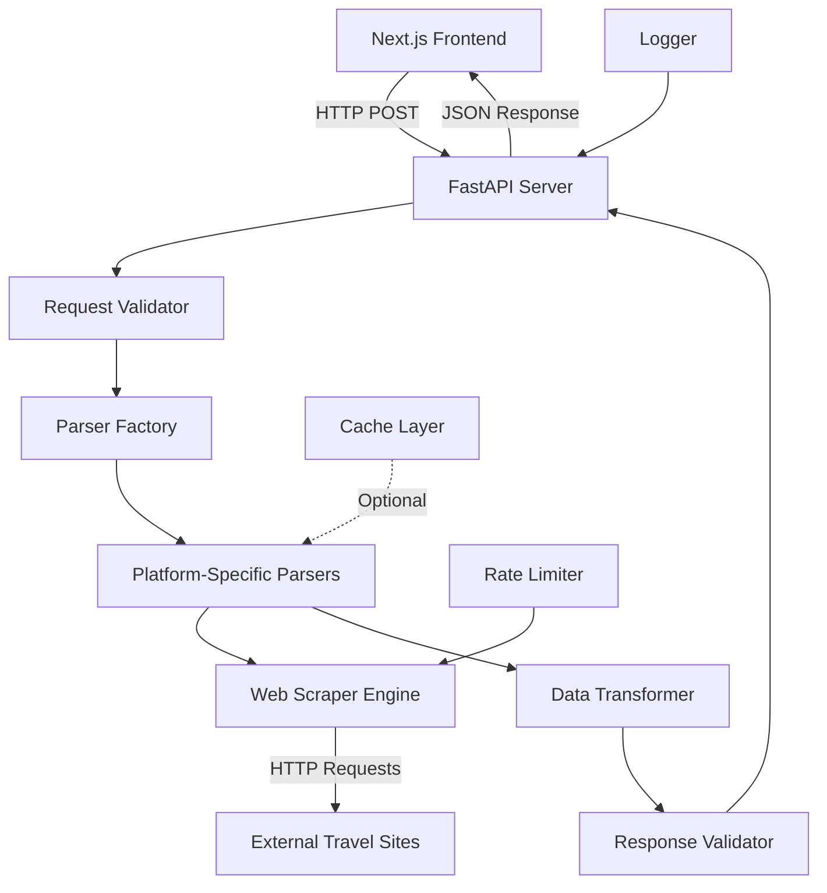

# Travel Data Parser - Design Document

## Overview

The Travel Data Parser is a FastAPI-based microservice that extracts structured travel booking information from various travel platform URLs. The system uses a modular parser architecture with platform-specific implementations, async processing for performance, and comprehensive error handling. The service integrates with a Next.js frontend application and supports multiple travel booking platforms including Google Flights, major airlines, Airbnb, Booking.com, and Hotels.com.

## Architecture

### High-Level Architecture



### Service Architecture Layers

1. **API Layer**: FastAPI application with CORS middleware and endpoint routing
2. **Validation Layer**: Pydantic models for request/response validation
3. **Business Logic Layer**: Parser factory and platform-specific parsers
4. **Data Access Layer**: Web scraping engine with HTTP clients
5. **Infrastructure Layer**: Caching, rate limiting, logging, and error handling

## Components and Interfaces

### Core FastAPI Application

```python
# Main application structure
class TravelDataParserApp:
    - FastAPI app instance
    - CORS middleware configuration
    - Exception handlers
    - Startup/shutdown events
    - Health check endpoint
```

**Configuration:**
- Title: "Travel Data Parser API"
- Version: "1.0.0"
- CORS origins: ["http://localhost:3000"] + production domains
- Request timeout: 60 seconds
- Rate limiting: 100 requests per minute per IP

### Request/Response Models

```python
# Pydantic Models
class FlightParseRequest(BaseModel):
    link: HttpUrl

class FlightParseResponse(BaseModel):
    origin_airport: str
    destination_airport: str
    duration: int  # minutes
    total_cost: float
    total_cost_per_person: float
    segment: int
    flight_number: str

class LodgingParseRequest(BaseModel):
    link: HttpUrl

class LodgingParseResponse(BaseModel):
    name: str
    location: str
    number_of_guests: int
    total_cost: float
    total_cost_per_person: int
    number_of_nights: int
    check_in: datetime
    check_out: datetime

class ErrorResponse(BaseModel):
    error: str
    message: str
    timestamp: datetime
```

### Parser Factory Pattern

```python
class ParserFactory:
    """Factory class to determine appropriate parser based on URL"""
    
    @staticmethod
    def get_parser(url: str) -> BaseParser:
        # URL pattern matching to determine platform
        # Returns appropriate parser instance
        
    @staticmethod
    def get_supported_domains() -> Dict[str, Type[BaseParser]]:
        # Returns mapping of domains to parser classes
```

**Supported Platform Detection:**
- Google Flights: `flights.google.com`
- Airbnb: `airbnb.com`, `airbnb.*`
- Booking.com: `booking.com`
- Hotels.com: `hotels.com`
- Major Airlines: Pattern-based detection for airline domains

### Base Parser Architecture

```python
class BaseParser(ABC):
    """Abstract base class for all parsers"""
    
    def __init__(self, http_client: AsyncHttpClient):
        self.http_client = http_client
        self.logger = logging.getLogger(self.__class__.__name__)
    
    @abstractmethod
    async def parse(self, url: str) -> Dict[str, Any]:
        """Parse URL and return structured data"""
        pass
    
    async def fetch_page(self, url: str) -> str:
        """Fetch page content with error handling"""
        pass
    
    def extract_data(self, html: str) -> Dict[str, Any]:
        """Extract data from HTML content"""
        pass
    
    def validate_data(self, data: Dict[str, Any]) -> Dict[str, Any]:
        """Validate and clean extracted data"""
        pass
```

### Platform-Specific Parsers

#### Flight Parsers

```python
class GoogleFlightsParser(BaseParser):
    """Parser for Google Flights URLs"""
    
    async def parse(self, url: str) -> Dict[str, Any]:
        # Extract flight data from Google Flights
        # Handle dynamic content loading
        # Parse flight segments, costs, airports
        
class AirlineParser(BaseParser):
    """Generic parser for airline websites"""
    
    async def parse(self, url: str) -> Dict[str, Any]:
        # Common airline website parsing logic
        # Adaptable patterns for different airlines
```

#### Lodging Parsers

```python
class AirbnbParser(BaseParser):
    """Parser for Airbnb URLs"""
    
    async def parse(self, url: str) -> Dict[str, Any]:
        # Extract Airbnb listing data
        # Handle pricing, dates, guest count
        
class BookingComParser(BaseParser):
    """Parser for Booking.com URLs"""
    
    async def parse(self, url: str) -> Dict[str, Any]:
        # Extract hotel booking data
        # Handle room details, pricing, dates
```

### Web Scraping Engine

```python
class AsyncHttpClient:
    """HTTP client with async support and anti-detection features"""
    
    def __init__(self):
        self.session = httpx.AsyncClient()
        self.user_agents = UserAgentRotator()
        self.rate_limiter = RateLimiter()
    
    async def get(self, url: str, **kwargs) -> httpx.Response:
        # Rate-limited HTTP requests
        # User-Agent rotation
        # Retry logic with exponential backoff
        
class SeleniumClient:
    """Selenium client for JavaScript-heavy sites"""
    
    async def get_dynamic_content(self, url: str) -> str:
        # Handle sites requiring JavaScript execution
        # Headless browser automation
```

### Data Transformation Layer

```python
class DataTransformer:
    """Transforms raw parsed data into standardized format"""
    
    @staticmethod
    def transform_flight_data(raw_data: Dict) -> Dict:
        # Standardize airport codes (IATA format)
        # Convert duration to minutes
        # Calculate per-person costs
        # Format flight numbers
        
    @staticmethod
    def transform_lodging_data(raw_data: Dict) -> Dict:
        # Standardize location format
        # Parse and validate dates (ISO format)
        # Calculate nights and per-person costs
        # Clean property names
```

## Data Models

### Flight Data Structure

```python
FlightData = {
    "origin_airport": str,      # IATA code preferred (e.g., "JFK")
    "destination_airport": str, # IATA code preferred (e.g., "CDG")
    "duration": int,           # Total flight time in minutes
    "total_cost": float,       # Total cost as decimal
    "total_cost_per_person": float, # Cost per person as decimal
    "segment": int,            # Number of flight segments/stops
    "flight_number": str       # Primary flight number (e.g., "AF123")
}
```

### Lodging Data Structure

```python
LodgingData = {
    "name": str,                    # Hotel/property name
    "location": str,                # City, country or full address
    "number_of_guests": int,        # Number of guests
    "total_cost": float,            # Total cost as decimal
    "total_cost_per_person": int,   # Cost per person
    "number_of_nights": int,        # Number of nights
    "check_in": datetime,           # ISO format with timezone
    "check_out": datetime           # ISO format with timezone
}
```

### Internal Data Flow

1. **Raw HTML** → BeautifulSoup parsing → **Extracted Elements**
2. **Extracted Elements** → Data transformation → **Standardized Data**
3. **Standardized Data** → Pydantic validation → **Response Model**

## Error Handling

### Error Categories and Responses

```python
class ErrorHandler:
    """Centralized error handling with consistent responses"""
    
    ERROR_CODES = {
        "INVALID_URL": (400, "Invalid or malformed URL provided"),
        "UNSUPPORTED_PLATFORM": (400, "Platform not supported"),
        "URL_UNREACHABLE": (500, "Unable to reach the provided URL"),
        "PARSING_FAILED": (500, "Failed to parse data from the URL"),
        "TIMEOUT": (500, "Request timeout exceeded"),
        "RATE_LIMITED": (429, "Rate limit exceeded, please try again later"),
        "MISSING_DATA": (500, "Required data not found on the page")
    }
```

### Error Handling Strategy

1. **Input Validation Errors** (HTTP 400):
   - Invalid URL format
   - Unsupported platform
   - Missing required fields

2. **External Service Errors** (HTTP 500):
   - Network timeouts
   - HTTP 404/403 responses
   - Parsing failures

3. **Rate Limiting Errors** (HTTP 429):
   - Too many requests per IP
   - External site rate limiting

4. **Logging Strategy**:
   - Error details with stack traces
   - Request context (URL, timestamp, IP)
   - Performance metrics (response time, success rate)

## Testing Strategy

### Unit Testing

```python
# Test structure for each parser
class TestGoogleFlightsParser:
    def test_parse_valid_flight_url()
    def test_parse_invalid_url()
    def test_missing_flight_data()
    def test_data_transformation()
    
class TestAirbnbParser:
    def test_parse_valid_listing_url()
    def test_parse_invalid_url()
    def test_missing_lodging_data()
    def test_date_parsing()
```

### Integration Testing

```python
class TestAPIEndpoints:
    def test_flight_endpoint_success()
    def test_flight_endpoint_error_cases()
    def test_lodging_endpoint_success()
    def test_lodging_endpoint_error_cases()
    def test_cors_headers()
    def test_rate_limiting()
```

### Mock Testing Strategy

- Mock external HTTP requests using `httpx_mock`
- Sample HTML responses for each supported platform
- Error scenario simulation (timeouts, 404s, parsing failures)
- Performance testing with concurrent requests

### Test Data Management

- Sample URLs for each supported platform
- Expected response data for validation
- Edge case scenarios (missing data, malformed pages)
- Performance benchmarks (response time < 10 seconds)

## Performance Optimization

### Async Processing

```python
# Concurrent request handling
async def process_multiple_requests(requests: List[ParseRequest]):
    tasks = [parse_single_request(req) for req in requests]
    results = await asyncio.gather(*tasks, return_exceptions=True)
    return results
```

### Caching Strategy

```python
class CacheManager:
    """Optional caching for recently parsed URLs"""
    
    def __init__(self, ttl: int = 3600):  # 1 hour TTL
        self.cache = {}
        self.ttl = ttl
    
    async def get_or_parse(self, url: str, parser_func) -> Dict:
        # Check cache first, parse if not found
        # Implement cache invalidation
```

### Rate Limiting

```python
class RateLimiter:
    """Rate limiting to avoid IP blocking"""
    
    def __init__(self, requests_per_minute: int = 60):
        self.requests_per_minute = requests_per_minute
        self.request_times = defaultdict(list)
    
    async def acquire(self, domain: str) -> bool:
        # Domain-specific rate limiting
        # Exponential backoff for blocked IPs
```

## Security Considerations

### Input Validation
- URL validation using Pydantic HttpUrl
- Domain whitelist for supported platforms
- Request size limits (max URL length)

### Rate Limiting
- Per-IP rate limiting (100 requests/minute)
- Per-domain rate limiting for external requests
- Exponential backoff for repeated failures

### Web Scraping Ethics
- Respect robots.txt files
- User-Agent rotation to avoid detection
- Reasonable request delays between calls
- Proxy support for IP rotation (optional)

### Data Privacy
- No storage of parsed data
- Request logging without sensitive information
- HTTPS-only external requests where possible

## Deployment Configuration

### Environment Variables

```python
# Configuration management
class Settings:
    API_TITLE: str = "Travel Data Parser API"
    API_VERSION: str = "1.0.0"
    CORS_ORIGINS: List[str] = ["http://localhost:3000"]
    REQUEST_TIMEOUT: int = 60
    RATE_LIMIT_PER_MINUTE: int = 100
    CACHE_TTL: int = 3600
    LOG_LEVEL: str = "INFO"
    ENABLE_SELENIUM: bool = False
```

### Docker Configuration

```dockerfile
# Multi-stage build for production
FROM python:3.11-slim as base
# Install dependencies
# Copy application code
# Configure for production deployment
```

### Production Deployment

- **ASGI Server**: Gunicorn with Uvicorn workers
- **Process Management**: Multiple worker processes
- **Health Checks**: `/health` endpoint for load balancer
- **Logging**: Structured JSON logging for monitoring
- **Monitoring**: Prometheus metrics for performance tracking

This design provides a robust, scalable, and maintainable solution for parsing travel booking data from multiple platforms while ensuring good performance and reliability.